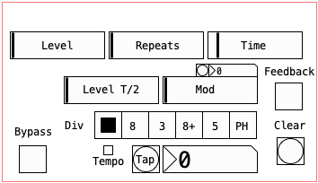

# Berelay

Berelay is an open source Pure Data patch that can run inside a DAW using the Camomile audio plugin by Pierre Guillot. It is a copy of the mdt-6 delay by the Argentinian pedal maker company "dedalo". It is intended for educational purposes.

Head to the Releases to get the plugin for your OS, or clone/download the source code to use it as a Pd patch.

Have fun!

fdch

## Credits

- [Camomile](https://github.com/pierreguillot/Camomile) by Pierre Guillot
- [Pure Data](http://msp.ucsd.edu/software.html) by Miller Puckette
- [Mdt-6](http://www.dedalofx.com.ar/) by Dedalo
